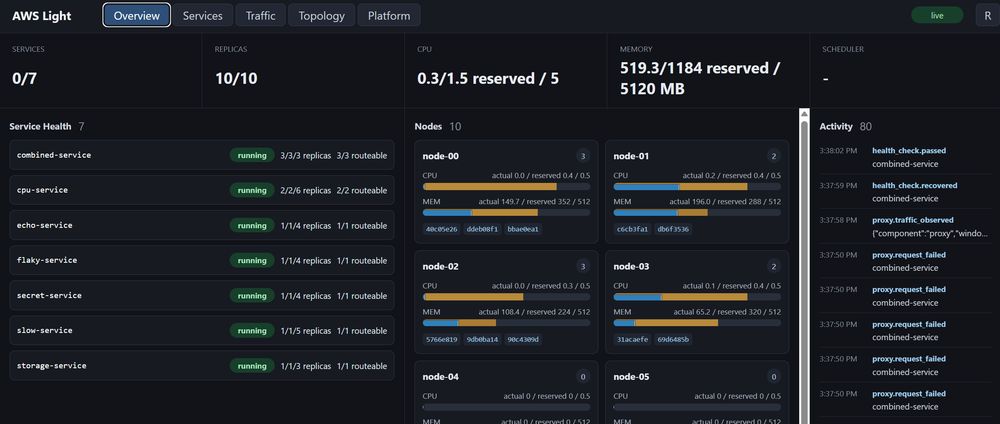
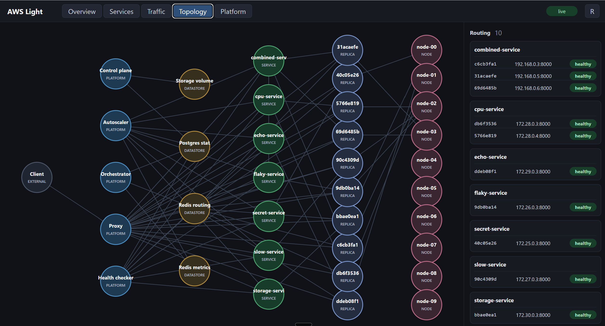

# AWS-Light

AWS-Light is a local cloud-platform simulator for running Dockerized services with
declarative manifests, service identity, internal ingress policy, managed buckets,
application databases, autoscaling signals, and a live dashboard.

It is intentionally small enough to understand end to end. The project is useful
as a demo, a learning tool, and a playground for control-plane/data-plane ideas
without needing a real AWS or Kubernetes account.



## What It Runs

The platform stack is split into services:

- **control-plane**: REST API, dashboard, WebSocket events, manifests, IAM, storage API.
- **orchestrator**: reconciles desired state into Docker containers and networks.
- **proxy**: exposes stable `*.localhost:8080` service names, enforces ingress policy, records traffic metrics.
- **health-checker**: probes replicas and updates routing health.
- **autoscaler**: adjusts desired replica counts from CPU and request metrics.
- **postgres**: durable platform state.
- **redis**: routing table, metrics, and event stream.

Managed workloads run as Docker containers on per-service networks. HTTP
service-to-service calls go through the proxy; database traffic goes directly to
per-database Postgres containers attached only to bound service networks.

## Quick Start

Prerequisites:

- Docker Desktop or Docker Engine with Compose.
- Python 3.10+ for the CLI and tests.
- PowerShell, Bash, or another shell that can run Docker commands.

Start the platform:

```powershell
Copy-Item .env.example .env
docker compose up -d --build
pip install -e ".[dev]"
aws-light login --user admin --password admin
```

Build the example workload images:

```powershell
docker build -t aws-light/cpu-service:latest examples/cpu-service
docker build -t aws-light/flaky-service:latest examples/flaky-service
docker build -t aws-light/combined-service:latest examples/combined-service
```

Deploy the full demo:

```powershell
aws-light apply examples/combined-stack.yaml
```

Open:

- Dashboard: <http://localhost:8000>
- Combined demo: <http://combined-service.localhost:8080/?demo_token=demo-token>

If your environment does not resolve `*.localhost`, use the proxy directly with
a `Host` header:

```powershell
curl.exe -H "Host: combined-service.localhost" "http://localhost:8080/?demo_token=demo-token"
```

## Main Demo

`examples/combined-stack.yaml` deploys one manifest that exercises the platform:

- `combined-service` is externally reachable and uses a demo token.
- `combined-service` writes and reads a platform bucket.
- `combined-service` inserts a row into a managed app database.
- `combined-service` calls `cpu-service` several times through the proxy.
- `cpu-service` has multiple replicas, so traffic demonstrates load balancing.
- `combined-service` calls `flaky-service`, which intentionally fails sometimes.
- `cpu-service` and `flaky-service` deny external access and only allow internal
  calls from `combined-service`.



## Documentation

- [Getting started](docs/getting-started.md)
- [Examples](docs/examples.md)
- [Manifests](docs/manifests.md)
- [Architecture](docs/architecture.md)
- [Topology and dashboard](docs/topology.md)
- [Operations and troubleshooting](docs/operations.md)
- [Future work](docs/future-work.md)

## Development

Run tests:

```powershell
pytest -q
```

Inspect the current platform:

```powershell
docker compose ps
aws-light status
aws-light storage ls
```

Tear down the platform containers:

```powershell
docker compose down
```

Use `docker compose down -v` only when you intentionally want to remove platform
Postgres and storage volumes.
