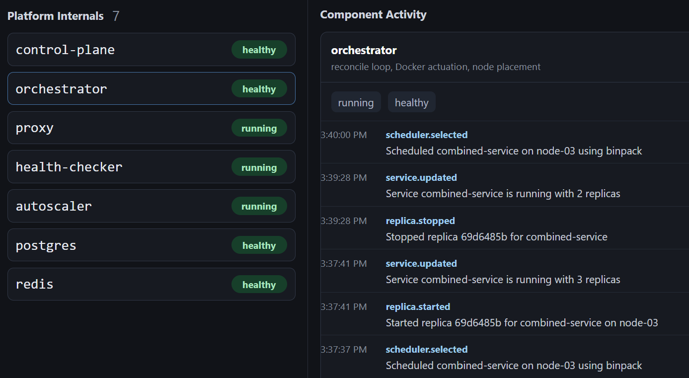
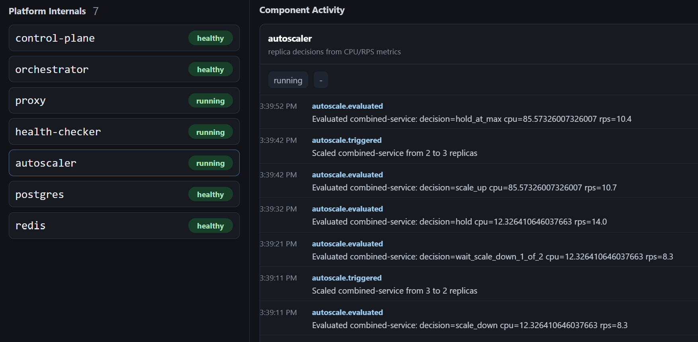

# Topology And Dashboard

The dashboard is served by the control plane at:

```text
http://localhost:8000
```

It gives a live view of platform services, managed workloads, metrics, events,
and topology.

## Dashboard Overview


The dashboard shows the control plane's view of:

- running platform services,
- managed services and replicas,
- node capacity and scheduling,
- proxy request metrics,
- recent platform events,
- autoscaler activity.

## Topology View


Topology combines desired state and observed traffic.

Node types include:

- platform components,
- services,
- replicas,
- buckets,
- databases,
- nodes.

Edge types include:

- service to replica,
- service to bucket binding,
- service to database binding,
- internal ingress allow rules,
- observed proxy traffic.

The topology is useful because it shows what the manifest says should be allowed
and what the proxy has actually observed.

## Orchestrator View



The orchestrator is responsible for turning desired service and database state
into Docker containers, Docker networks, and routing table entries.

Use this view when checking whether replicas were created, restarted, or placed
on simulated nodes.

## Autoscaler View



The autoscaler view helps explain replica-count changes. It reads CPU and RPS
signals and updates service desired state. The orchestrator then performs the
actual container changes.

## Interpreting Failures

Common topology and dashboard signals:

- `external ingress denied`: a host request reached a service with `external: false`.
- `internal ingress denied`: a workload tried to call a service that did not allow that source.
- `no healthy replica found`: the routing table has no healthy endpoint for the target.
- flaky downstream responses: expected when using `flaky-service`.
- missing database edges: the service is not bound to the database in its manifest.

Denied proxy events are useful for validating policy. A denied request is often
the platform doing the right thing.
